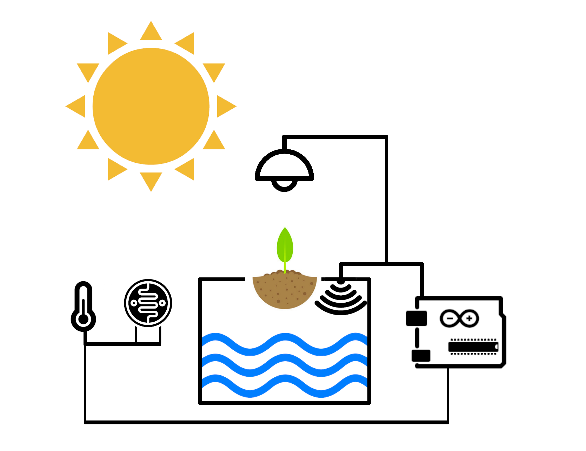
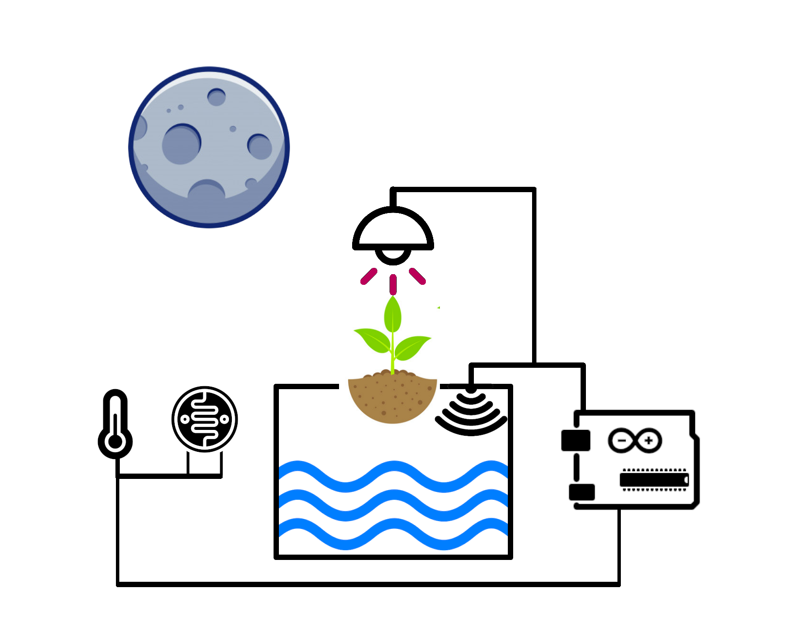

# Hydropot 

Designed for my Embedded system classes, a while ago. The hydro pot measures temperature, humidity, water and light level. Depending on these values it turn on the Leds and displays the values. Timelapse of working system.
https://www.youtube.com/watch?v=TiQmTjOGO_o
## Schematics

There are two versions of my hydropot system:

 1. Hydropot
During my classes I was limited by the components i had available on hand. It's basically the same thing as extended version but without display and pump. I also couldn't get the same components as in tinkercad  so I used substitutes.
 2. Hydropot Extended verison of the circuit was designed using tinkercad. 
https://www.tinkercad.com/things/l8qw3HvihGN

## 3d files
Unfortunately I made 3d files long before i designed this system so i don't have them anymore. 

## Plans of future

 - [ ] remake missing 3d files,
 - [ ]  make 3d enclosure for sensors,
 - [ ]  make class hydrosensors dynamic (meaning just assign sensor pins in constructor and let it do everything else),
 - [ ] add serial control steering,
 - [ ] add Co2 sensor,
 - [ ]  change led lights to grow lightbulbs with a use of "SRD-05VDC-SL-C Songle"

### Old documentation
Old documentation was made fully with LaTeX. I leave all the TeX code in Latex  documentation folder.
